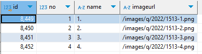
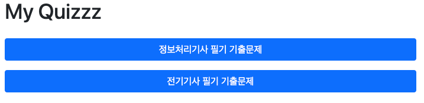

# My Quiz...
* 각 자격증 시험 문제를 관리, 풀이할 수 있는 프로젝트
* Demo: http://3.37.253.88:8888/

# Swagger
* 전체 컨트롤러를 확인


## build & run
### database
* postgresql db 생성
```sql
CREATE USER mydbuser WITH password 'mydbuser';
CREATE DATABASE eipdatabase OWNER mydbuser ENCODING 'UTF8'; 
```

* schema & init data
  * [schema.sql](src/main/resources/sql/schema.sql)
  * [initdata.sql](src/main/resources/sql/initdata.sql)

### build 
```shell
mvn clean package -DskipTests
```

### run
* 민감정보 암호화를 하는 경우, [JasyptEncryptionExample.java](src/main/java/kr/giljabi/eip/util/JasyptEncryptionExample.java) 참고해서 위에서 만든 사용자, 비밀번호, URL을 암호화하고 암호화키를 run.sh에 추가
```shell
* run.sh
```shell
#!/bin/sh
APP_NAME=eip-1.0.jar

PID=$(ps -ef | grep $APP_NAME | grep -v grep | awk '{print $2}')
if [ -z "$PID" ]; then
    echo "Application is not running."
else
    echo "Killing application with PID: $PID"
    kill -9 $PID
    echo "Application terminated."
fi

echo "Start EIP application"
nohup /usr/lib/jvm/java-8-openjdk-amd64/bin/java -jar -Dspring.profiles.active=prod -Xms256m -Xmx256m -Djava.net.preferIPv4Stack=true -Duser.timezone=Asia/Seoul -Djasypt.encryptor.password=암호화키 $APP_NAME > /dev/null 2>&1 &
```

## 1. 로그인
* 문제 등록기능으로 운영자만 사용
### url: /usr/login
```text
id: admin@admin.com
password: qweqwe123
```

## 2. 관리자 기능
### 문제 배치등록
  * [QuizLoaderController.java](src/main/java/kr/giljabi/eip/controller/register/QuizLoaderController.java)에서 파일을 읽어서 문제를 등록

#### 데이터 파일 구조
  * 기출문제는 보통 pdf로 구할 수 있으며, pdf를 text로 변환하여 문제를 등록할 수 있도록 함
  * sample code : python/exam.py
  * pdf파일 변환 SW를 사용해도 완벽하게 되지 않으므로 아래와 같은 형식으로 완성해야 함
  * {{qif:0,cif:1}}: qif: 질문지에 이미지가 있는(1:true) 경우 question.questionimageflag에 true 저장, cif: 선택지가 이미지인 경우(1:true)를 구분해서 question.choiceimageflag에 true 저장하고, 이미지 경로를 imageurl에 함께 저장
  * 문제당 5줄, 문제 1줄, 선택 4줄로 항상 구성해야 함
  * 이미지 파일은 별도 문제수정 화면에서 개별로 저장해야 함

#### Line 1: 시험정보
* ExamNO(시험차수): examno 테이블에 있는 ID
* 과목ID: subject 테이블에 있는 ID
```text
### ExamNO:8, 과목ID:2
```

#### Line 2~501: 질문, 선택지 정보는 5줄로 구성
* {{qif:0,cif:1}} : 질문에 이미지 유무(qif), 선택지에 이미지 유무(cif)를 구분, 이미지가 없으면 생략
* 아래 이미지와 같은 문제는 
  qif:1, 배치 등록시 question.questionimageflag, question.choiceimageflag에 true 저장
  question.imageurl에 이미지 경로(/images/q/2022/{id}.png)를 저장하므로 이미지 부분만 작성 후 복사
```sql
select no, name, imageurl, questionimageflag, choiceimageflag
from question
```

* cif:1, 배치 등록시 choice.imageurl에 이미지 경로(/images/q/2022/{id}-{no}.png)를 저장되므로, 이미지는 작성 후 이미지 경로에 복사
```sql
select b.id, b.no, b.name, b.imageurl
from question a, choice b
where a.id=b.question_id
```


* 이미지 경로와 파일명은 question(where qiq=과목ID and questionimageflag=true and examno_id=차수ID)
  chocie 테이블은 question와 join해서 선택지 이미지 경로와 파일명을 확인할 수 있음


* 최종 배치 데이터(항상 5줄 유지해야 함)
```text
{{qif:1,cif:1}}13. 그림과 같이 점 O를 중심으로 반지름이 a(m)인 구도체 1과 안쪽 반지름이 b(m)이고 바깥쪽 반지름이 C(m)인 구도체 2가 있다. 이 도체계에서 전위계수 P11(1/F)에 해당하는 것은?
	1
	2
	3
	4
```
#### Line 502~511: 정답
* 정답은 10줄로 구성하며 시작에 correct를 붙임
```text
correct 4332314241
correct 1343411142
correct 3242234241
correct 1342342141
correct 2434122441
correct 3124324343
correct 2124412213
correct 2144133313
correct 4312244332
correct 4423334313
```

### 문제 수정/등록
  * 문제 관리는 로그인 후 사용
  * id: admin@admin.com, pass: qweqwe123


## 3. 문제풀이
### url: /



```text
최초 접속시 서버에서 cookie를 만들어 접속한 사용자를 구분
```

### url: /questions/random/1/0
```text
현재 예제 데이터는 정보처리기사 문제임
1: 시험종목(1: 정보처리기사)
0: 과목(0: 모든과목, 1:소프트웨어설계, 2:소프트웨어개발, 3:데이터베이스구축, 4:프로그래밍언어활용, 5:정보시스템구축관리)
```

## 3. 풀이결과
### url: /questions/results/1
* 시험종목: 정보처리기사(1)
* 쿠키로 구분된 사용자의 풀이 결과


## 4. DB Model
### ER
</img><br/>


